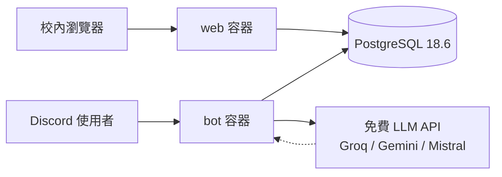

<p align="center">
  <a href="#readme"></a>
  <a href="docs/README.en-GB.md"></a>
</p>

<p align="center">
  
</p>

<h1 align="center">AIPAR ETA</h1>

<p align="center">
  <strong>實驗室伙食系統</strong><br>
  Discord 建檔、揪團、點餐、結算；校內網站只負責查閱。<br>
  金額由程式依庫內價格計算，模型不得自行定價。
</p>

<p align="center">
  
  
  
  
  
  
</p>

<p align="center">
  <a href="#功能">功能</a> ·
  <a href="#示範">示範</a> ·
  <a href="#架構">架構</a> ·
  <a href="#安裝">安裝</a> ·
  <a href="#專案結構">結構</a> ·
  <a href="#貢獻">貢獻</a> ·
  <a href="DEPLOY.md">校內部屬</a> ·
  <a href="docs/README.md">文件索引</a>
</p>

---

實驗室中午要點什麼、誰點了什麼、最後誰該付多少——這件事不該再散落在十則訊息裡。
AIPAR ETA 把餐廳菜單、論壇揪團與帳本收進同一套系統：寫入走 Discord bot，查閱走校內網站，資料放 PostgreSQL。自然語言與菜單辨識只用**免費 LLM API**；沒有金鑰時按鈕與下拉仍可點餐。

> **現況（0.2.0）**　三個產品功能已落地，離線測試、端到端 smoke、容器健康檢查已在本機通過。
> Discord 伺服器裡的真人操作（開團、按鈕、自然語言、結算）尚未驗收。

## 功能

<table>
<tr>
<td width="33%" valign="top">

### 菜單建檔與查詢

`/餐廳 新增` 建檔，`/菜單 上傳` 丟照片或 `/菜單 輸入` 貼文字。辨識結果只會變成**草稿**，有人按下「確認寫入」才上線。查詢可用指令，也可以 @ bot 問「聞香來有什麼」。

</td>
<td width="33%" valign="top">

### 揪團點餐

`/揪團` 在論壇開一則貼文，bot 自動貼菜單與彙總。成員按「點餐」用下拉複選，或直接打「我要兩個雞腿飯跟一杯紅茶」。全體清單與每人應付會持續更新。

</td>
<td width="33%" valign="top">

### 記帳與分攤

`/結算` 把每人小計寫進帳本；同場同人不會重複計費。`/帳務 我的`、`/帳務 總覽`、`/帳務 付款` 查餘額與記錄付款。餘額永遠由紀錄算出來，不另存欄位。

</td>
</tr>
</table>

| 還有這些 | 為什麼這樣做 |
| --- | --- |
| **校內網站唯讀** | 沒有公有網域；寫入只留一條授權路徑（Discord）。 |
| **規則優先、模型墊底** | 對得到就不打 LLM，省免費層配額，結果也比較可預測。 |
| **價格只來自 `menu_items`** | 模型負責「指到哪一項、要幾份」，不得改帳。 |
| **繁中／英式英文** | Discord 語言為中文（繁／簡）時畫面用繁體中文，其餘用英式英文。 |

## 示範

畫面為依實際字串表與網站樣式繪製的示意，不是即時資料。

<p align="center">
  
</p>
<p align="center"><sub>論壇貼文裡的彙總 Embed。Ack Reaction（👀）與 Streaming Preview 會在等待 LLM 時出現。</sub></p>

<p align="center">
  
</p>
<p align="center"><sub>校內瀏覽器開 <code>http://&lt;伺服器內網IP&gt;:3000/</code>。樣式內嵌，不依賴外部 CDN。</sub></p>

### 一條完整路徑

```text
/設定 論壇 頻道:#訂餐
        ↓
/餐廳 新增　聞香來
        ↓
/菜單 上傳　（或 /菜單 輸入）→ 核對草稿 → 確認寫入
        ↓
/揪團　指定餐廳與截止時間 → 論壇貼文
        ↓
按「點餐」或打字　「我要一個雞腿飯加紅茶」
        ↓
/結算　→ /帳務 我的
```

網站對應頁面：`/` 總覽、`/restaurants/:id` 菜單、`/sessions/:id` 該場彙總。

## 架構



兩個入口共用資料庫，**都不直接寫 SQL**：`bot` 與 `web` 只呼叫 `db/` 與 `domain/`。LLM 閘道走 OpenAI 相容 wire format，換一家只換 `base_url`、金鑰、模型 ID，不引任何 LLM SDK。

| 層 | 目錄 | 可以依賴 |
| --- | --- | --- |
| 共用 | `src/shared/` | 無 |
| 資料 | `src/db/` | `shared` |
| 業務 | `src/domain/` | `shared`、`db` 型別 |
| 模型 | `src/llm/` | `shared`、`domain` |
| 入口 | `src/bot/`、`src/web/` | 以上皆可；彼此不互相 import |

契約與拓樸寫在 [`SPEC/`](SPEC/README.md)。產品意圖在 [`PLAN/plan_initial.md`](PLAN/plan_initial.md)。衝突時：**程式碼 > SPEC > PLAN**。

## 安裝

需要 Docker Engine 28+（Compose v2／v5）與已填寫的 `.env`。本機開發另需 Node.js ≥ 24.12。

### 1. 環境變數

```powershell
Copy-Item .env.example .env
```

```bash
cp .env.example .env
```

至少填 `POSTGRES_DB`、`POSTGRES_USER`、`POSTGRES_PASSWORD`。Discord 權杖與 LLM 金鑰可稍後再補：沒填時 bot 只維持健康檢查，網站與資料庫仍可啟動。

### 2. 啟動容器

遷移會在 `web`／`bot` 啟動時自動套用，不必另下指令。

```powershell
docker compose up --build -d
docker compose ps
```

三個服務都應為 `healthy`。瀏覽器或 `curl` 開 <http://127.0.0.1:3000/health>，應看到 `ok: true` 與資料庫時間。

### 3. Discord（要用 bot 時）

1. 開發者後台 → Bot → Privileged Gateway Intents → 打開 **Message Content Intent**。沒開的話自然語言點餐與貼菜單都會拿到空字串。
2. 邀請時至少要有：檢視頻道、發送訊息、在討論串發送訊息、**建立貼文**、嵌入連結、加上反應。
3. 在伺服器裡指定論壇頻道，`/揪團` 才有地方開貼文：

```text
/設定 論壇 頻道:#訂餐
```

斜線指令改過定義後執行 `npm run register`（或 `docker compose exec bot node src/scripts/register-commands.ts`）。

### 4. 常用指令

| 指令 | 用途 | 需要 |
| --- | --- | --- |
| `npm run check` | 型別檢查 ＋ 29 項離線測試 | — |
| `npm test` | 只跑測試 | — |
| `npm run smoke` | 建檔→菜單→揪團→點餐→結算→帳務，跑完自清 | 資料庫 |
| `npm run llm:check` | 每家供應商實際打一次 | 金鑰、外網 |
| `npm run register` | 重新註冊斜線指令 | Discord 權杖 |

停止容器：`docker compose down`（資料卷會保留）。連資料一併刪除是 `docker compose down -v`，**先確認**。

校內 24/7 伺服器、備份與連續運行注意事項見 [`DEPLOY.md`](DEPLOY.md)。

## 專案結構

```text
AIPAR-ETA/
├── src/
│   ├── web.ts / bot.ts     行程進入點
│   ├── config.ts           環境變數（缺必要值就失敗並印變數名）
│   ├── shared/             時間、金額、文字正規化、日誌
│   ├── db/                 一張表一個模組；遷移在 db/sql/
│   ├── domain/             菜單正規化、點餐彙總、結算（不認識 Discord）
│   ├── llm/                供應商、換手、任務提示詞
│   ├── bot/                指令、元件、訊息、在地化字串
│   ├── web/                頁面與唯讀 JSON API
│   └── scripts/            smoke、llm-check、register-commands
├── test/                   node:test 離線測試（也是行為說明書）
├── SPEC/                   架構與資料契約
├── PLAN/                   規劃草稿與菜單範例圖
├── docs/                   英文 README、貢獻指南、Hero／Demo 圖
├── compose.yaml            postgres / web / bot
├── DEPLOY.md               校內部屬
└── CHANGELOG.md            變更紀錄
```

根目錄 `requirements.txt` 依現況不列 pip 套件——這不是 Python 專案，執行相依以 `package.json` 為準。

## 技術細節

<details>
<summary>斜線指令（中文 ≤ 6 字，英文 ≤ 10 字母）</summary>

| 英文（預設） | 中文 | 作用 |
| --- | --- | --- |
| `/restaurant` | `/餐廳` | 新增／清單／資訊 |
| `/menu` | `/菜單` | 查看、上傳、輸入、版本 |
| `/groupbuy` | `/揪團` | 開論壇貼文 |
| `/order` | `/點餐` | 在揪團貼文裡點餐 |
| `/settle` | `/結算` | 結算並寫入帳本 |
| `/ledger` | `/帳務` | 我的／總覽／付款 |
| `/help` | `/說明` | 使用說明 |
| `/setup` | `/設定` | 指定揪團論壇（需管理伺服器權限） |

`restaurant` 選項開自動完成，回傳值是資料庫 id。完整流程見 [`SPEC/bot-interactions.md`](SPEC/bot-interactions.md)。

</details>

<details>
<summary>網站頁面與唯讀 API</summary>

| 路徑 | 內容 |
| --- | --- |
| `GET /` | 餐廳清單與最近揪團 |
| `GET /restaurants/:id` | 上線中的菜單 |
| `GET /sessions/:id` | 該場全體清單與每人應付 |
| `GET /health` | 服務與資料庫時間 |
| `GET /api/restaurants` | `keyword` 可篩選 |
| `GET /api/sessions` | `guild` 可篩選，最近 30 場 |
| `GET /api/ledger/:guild-id` | 每個人的結餘 |
| `GET /api/llm-usage` | `hours` 預設 24 |

金額在 JSON 裡以**元**為單位。非 GET 回 405。契約見 [`SPEC/web-api.md`](SPEC/web-api.md)。

</details>

<details>
<summary>環境變數（名稱，不含祕密）</summary>

| 變數 | 必要 | 說明 |
| --- | --- | --- |
| `POSTGRES_*` | ✓ | 資料庫連線。容器內 `POSTGRES_HOST` 會被覆寫成 `postgres` |
| `APP_HOST` / `APP_PORT` | | 網站，預設 `0.0.0.0:3000` |
| `BOT_HEALTH_PORT` | | bot 健康檢查，預設 `3001` |
| `TZ` | | 預設 `Asia/Taipei` |
| `DISCORD_BOT_TOKEN` / `DISCORD_CLIENT_ID` | bot 要用時 | 沒填就不連 Discord、不註冊指令 |
| `*_API_KEYS` | | 逗號分隔多把；留空＝跳過該供應商 |
| `*_MODEL` / `*_VISION_MODEL` | | 有金鑰沒填模型 ID＝跳過並記原因，不拿猜的 ID 去打 |
| `LLM_ALLOW_METERED` | | `true` 才啟用計費型供應商（iAI），預設關閉 |
| `LOCAL_LLM_BASE_URL` | | 本機模型保底；不要在容器內跑本地 LLM |

範本與註解在 [`.env.example`](.env.example)。`.env` 不進 Git、不進映像。

</details>

<details>
<summary>LLM 閘道與兩條紅線</summary>

供應商：Groq（文字第一棒）→ Gemini（視覺第一棒）→ Mistral → 本機。計費的 iAI 預設關閉。

- **空回覆視為該家失敗**並換下一家（Gemini 免費層常把 token 花在思考上）。
- 429／5xx 同一把重試一次再換手；401／403 立刻換下一把。
- 菜單圖片辨識與文字模型分開排隊。

紅線：價格永遠查 `menu_items`；規則對得到就不呼叫模型。細節見 [`SPEC/llm-gateway.md`](SPEC/llm-gateway.md)。採用前請跑 `npm run llm:check`，價目表上有的模型不一定打得到。

</details>

<details>
<summary>執行時期（2026-09-18 查證）</summary>

- Node.js 24 Active LTS（Krypton），≥ 24.12 以 type stripping 直接跑 `.ts`，無建置步驟
- PostgreSQL 18.6（`postgres:18.6-alpine`；19 當時仍為 beta）
- discord.js 14.27、`pg` 8.23
- 映像：`node:24-bookworm-slim`，非 root 使用者 `node`，時區 `Asia/Taipei`
- 編排檔：`compose.yaml`（Compose Specification，不含過時的 `version` 欄）
- `postgres` 埠只綁 `127.0.0.1`，不對校園網開放

</details>

## 貢獻

實驗室內部專案。改程式前請讀 [`CONTRIBUTING.md`](CONTRIBUTING.md)（[English (UK)](docs/CONTRIBUTING.en-GB.md)）與 [`.cursorrules`](.cursorrules)。

簡要約定：變數／函式 `snake_case`；註解與維護者錯誤訊息用繁體中文；動到契約要同步 `SPEC/`；每次變更更新 `CHANGELOG.md` 的 `Unreleased`（Keep a Changelog 2.0.0；發版才給新版號）；`npm run check` 要全綠。不要抄隔壁 `AIPAR-ordering-system` 的程式或架構。

## 授權

本倉庫 `package.json` 標為 `"private": true`，**尚未指定公開授權條款**。供實驗室內部使用；未經同意請勿散布原始碼、映像或金鑰。

---

<p align="center">
  <sub>AIPAR ETA　·　實驗室伙食系統　·　台北時間</sub>
</p>
