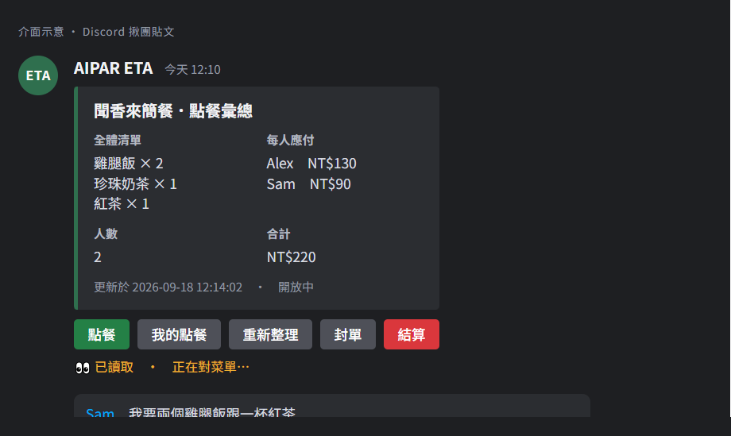
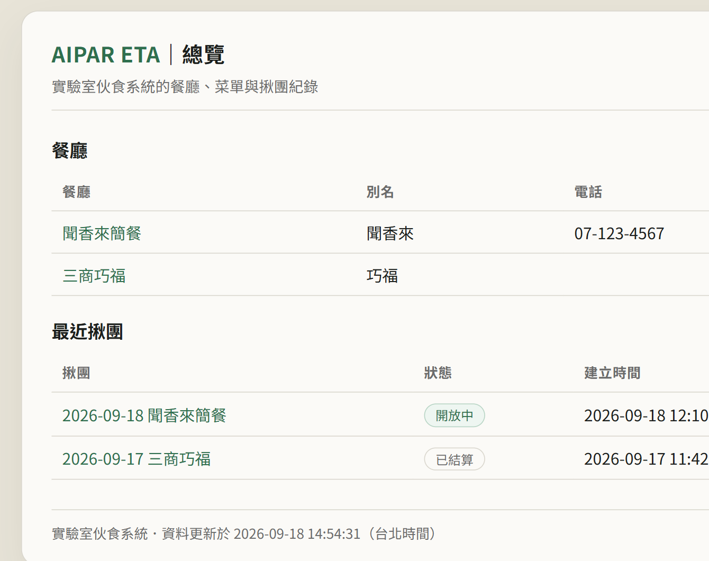
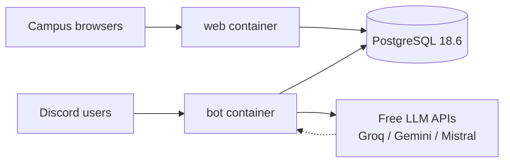

<p align="center">
  <a href="../README.md"></a>
  <a href="#readme"></a>
</p>

<p align="center">
  
</p>

<h1 align="center">AIPAR ETA</h1>

<p align="center">
  <strong>Laboratory meals system</strong><br>
  Catalogue menus, open group orders, and settle the ledger on Discord.<br>
  The campus website is read-only. Prices always come from the database — never from the model.
</p>

<p align="center">
  
  
  
  
  
  
</p>

<p align="center">
  <a href="#features">Features</a> ·
  <a href="#demo">Demo</a> ·
  <a href="#architecture">Architecture</a> ·
  <a href="#installation">Installation</a> ·
  <a href="#project-structure">Structure</a> ·
  <a href="#contributing">Contributing</a> ·
  <a href="../DEPLOY.md">Campus deploy</a> ·
  <a href="./README.md">Docs index</a>
</p>

---

Lunch orders should not live across ten Discord messages. AIPAR ETA keeps restaurants, forum group-buys, and the ledger in one system: **writes go through the Discord bot**, **reads go through the campus website**, and **state lives in PostgreSQL**. Natural language and menu-image recognition use **free LLM APIs only**. With no keys at all, buttons and dropdowns still work.

> **Status (0.2.0).** The three product features are implemented. Offline tests, the end-to-end smoke run, and container health checks have passed locally.
> Live Discord use (opening a round, buttons, plain-language orders, settling) has not yet been signed off with real people in a server.

English in this project is **British English**. Discord users whose client language is Chinese (Traditional or Simplified) see Traditional Chinese; everyone else sees English.

## Features

<table>
<tr>
<td width="33%" valign="top">

### Menus

`/restaurant add` registers a place. `/menu upload` reads a photo, or `/menu input` takes pasted text. Recognition produces a **draft** only; someone must press *Confirm* before it goes live. People can also mention the bot and ask what a restaurant serves.

</td>
<td width="33%" valign="top">

### Group orders

`/groupbuy` opens a forum post; the bot pins the menu and a running summary. Members press *Order* for a multi-select dropdown, or type “one chicken rice and a tea”. The combined list and per-person totals stay in sync.

</td>
<td width="33%" valign="top">

### Ledger

`/settle` writes each person’s subtotal. The same person is never charged twice for the same round. `/ledger mine`, `/ledger all`, and `/ledger pay` show balances and record payments. Balances are always derived from entries — they are not stored as a column.

</td>
</tr>
</table>

| Also | Why |
| --- | --- |
| **Read-only campus site** | No public domain; a single write path (Discord) keeps authorisation simple. |
| **Rules first, model second** | If a rule matches, the LLM is skipped. Free quotas last longer and results stay predictable. |
| **Prices from `menu_items` only** | The model maps names and quantities. It must not set prices or rewrite the books. |
| **zh-Hant / en-GB** | Localisation tables always ship both languages; missing one fails the type check. |

## Demo

These frames follow the live string table and website stylesheet. They are illustrations, not a live feed.

<p align="center">
  
</p>
<p align="center"><sub>Summary embed in the forum post. An Ack reaction (👀) and a streaming preview appear while the bot waits on an LLM.</sub></p>

<p align="center">
  
</p>
<p align="center"><sub>On the campus network: <code>http://&lt;server-LAN-IP&gt;:3000/</code>. CSS is inlined so the page does not depend on an external CDN.</sub></p>

### One complete path

```text
/setup forum  channel:#orders
        ↓
/restaurant add   Wen Xiang Lai
        ↓
/menu upload   (or /menu input) → check the draft → Confirm
        ↓
/groupbuy   restaurant + deadline → forum post
        ↓
Press Order, or type   “one chicken rice and a tea”
        ↓
/settle   → /ledger mine
```

Website routes: `/` overview, `/restaurants/:id` menu, `/sessions/:id` that round’s summary.

## Architecture



Both entry points share the database and **never write SQL themselves**: `bot` and `web` call `db/` and `domain/` only. The LLM gateway speaks the OpenAI-compatible wire format. Switching provider means changing `base_url`, the key, and the model id — no LLM SDK is imported.

| Layer | Directory | May depend on |
| --- | --- | --- |
| Shared | `src/shared/` | nothing |
| Data | `src/db/` | `shared` |
| Domain | `src/domain/` | `shared`, `db` types |
| Models | `src/llm/` | `shared`, `domain` |
| Edges | `src/bot/`, `src/web/` | the layers above; not each other |

Contracts live in [`SPEC/`](../SPEC/README.md). Product intent lives in [`PLAN/plan_initial.md`](../PLAN/plan_initial.md). If they disagree: **code > SPEC > PLAN**.

## Installation

You need Docker Engine 28+ (Compose v2 / v5) and a filled-in `.env`. Local scripts also need Node.js ≥ 24.12.

### 1. Environment

```powershell
Copy-Item .env.example .env
```

```bash
cp .env.example .env
```

Set at least `POSTGRES_DB`, `POSTGRES_USER`, and `POSTGRES_PASSWORD`. Discord tokens and LLM keys can wait: without them the bot stays on its health port, and the website plus database still start.

### 2. Compose

Migrations run when `web` and `bot` start. There is no separate migrate step.

```powershell
docker compose up --build -d
docker compose ps
```

All three services should be `healthy`. Open <http://127.0.0.1:3000/health> — you should see `ok: true` and the database time.

### 3. Discord (when you want the bot)

1. Developer Portal → Bot → Privileged Gateway Intents → enable **Message Content Intent**. Without it, plain-language orders and pasted menus arrive as empty strings.
2. Invite with: View Channels, Send Messages, Send Messages in Threads, **Create Posts**, Embed Links, Add Reactions.
3. Point the bot at a forum channel so `/groupbuy` has somewhere to post:

```text
/setup forum  channel:#orders
```

After changing slash-command definitions, run `npm run register` (or `docker compose exec bot node src/scripts/register-commands.ts`).

### 4. Everyday commands

| Command | What it does | Needs |
| --- | --- | --- |
| `npm run check` | typecheck + 29 offline tests | — |
| `npm test` | tests only | — |
| `npm run smoke` | restaurant → menu → group buy → order → settle → ledger, then cleans up | database |
| `npm run llm:check` | one live call per provider | keys, network |
| `npm run register` | re-register slash commands | Discord token |

Stop with `docker compose down` (the volume stays). `docker compose down -v` **drops the database** — ask first.

Campus 24/7 hosting, backups, and week-long uptime notes: [`DEPLOY.md`](../DEPLOY.md).

## Project structure

```text
AIPAR-ETA/
├── src/
│   ├── web.ts / bot.ts     process entry points
│   ├── config.ts           env loader (missing required names fail fast)
│   ├── shared/             time, money, text, logging
│   ├── db/                 one module per table; SQL in db/sql/
│   ├── domain/             menu drafts, summaries, settlement
│   ├── llm/                providers, failover, task prompts
│   ├── bot/                commands, components, messages, i18n
│   ├── web/                pages and read-only JSON
│   └── scripts/            smoke, llm-check, register-commands
├── test/                   node:test (also a behaviour spec)
├── SPEC/                   architecture and data contracts
├── PLAN/                   product draft and sample menu photos
├── docs/                   this English README, contributing, artwork
├── compose.yaml            postgres / web / bot
├── DEPLOY.md               campus server
└── CHANGELOG.md            history (Traditional Chinese)
```

The root `requirements.txt` lists no pip packages on purpose. This is not a Python project; runtime dependencies are in `package.json`.

## Technical details

<details>
<summary>Slash commands (Chinese ≤ 6 characters, English ≤ 10 letters)</summary>

| English (default) | Chinese | Role |
| --- | --- | --- |
| `/restaurant` | `/餐廳` | add / list / info |
| `/menu` | `/菜單` | show, upload, input, version |
| `/groupbuy` | `/揪團` | open a forum post |
| `/order` | `/點餐` | order inside that post |
| `/settle` | `/結算` | settle and write the ledger |
| `/ledger` | `/帳務` | mine / all / pay |
| `/help` | `/說明` | how to use |
| `/setup` | `/設定` | forum channel (Manage Server) |

Restaurant options use autocomplete and return a database id. Full flows: [`SPEC/bot-interactions.md`](../SPEC/bot-interactions.md).

</details>

<details>
<summary>Website pages and read-only API</summary>

| Path | Content |
| --- | --- |
| `GET /` | restaurants and recent rounds |
| `GET /restaurants/:id` | active menu |
| `GET /sessions/:id` | combined order and per-person totals |
| `GET /health` | service and database time |
| `GET /api/restaurants` | optional `keyword` |
| `GET /api/sessions` | optional `guild`, last 30 |
| `GET /api/ledger/:guild-id` | balances |
| `GET /api/llm-usage` | `hours` defaults to 24 |

JSON amounts are in **yuan**, not cents. Non-GET methods return 405. Contract: [`SPEC/web-api.md`](../SPEC/web-api.md).

</details>

<details>
<summary>Environment variables (names only)</summary>

| Variable | Required | Notes |
| --- | --- | --- |
| `POSTGRES_*` | yes | Inside Compose, `POSTGRES_HOST` is overwritten to `postgres` |
| `APP_HOST` / `APP_PORT` | | website, default `0.0.0.0:3000` |
| `BOT_HEALTH_PORT` | | bot health, default `3001` |
| `TZ` | | default `Asia/Taipei` |
| `DISCORD_BOT_TOKEN` / `DISCORD_CLIENT_ID` | to run the bot | omit = no Discord connection, no command registration |
| `*_API_KEYS` | | comma-separated; blank skips that provider |
| `*_MODEL` / `*_VISION_MODEL` | | a key without a model id is skipped on purpose — never guess |
| `LLM_ALLOW_METERED` | | `true` enables the metered provider (iAI); off by default |
| `LOCAL_LLM_BASE_URL` | | local fallback; do not run a local model inside the container |

See [`.env.example`](../.env.example). Never commit `.env` or bake it into the image.

</details>

<details>
<summary>LLM gateway and two hard rules</summary>

Order of attempt: Groq (text) → Gemini (vision) → Mistral → local. Metered iAI stays off unless `LLM_ALLOW_METERED=true`.

- An **empty reply counts as failure** and the next provider is tried (Gemini’s free tier often spends `max_tokens` on thinking).
- 429 / 5xx: retry the same key once, then fail over. 401 / 403: skip that key immediately.
- Vision and text models are queued separately.

Hard rules: unit prices always come from `menu_items`; a matching rule means the model is not called. Details: [`SPEC/llm-gateway.md`](../SPEC/llm-gateway.md). Run `npm run llm:check` before going live — a name on a price list is not the same as an ID you can actually call.

</details>

<details>
<summary>Runtime (verified 2026-09-18)</summary>

- Node.js 24 Active LTS (Krypton), ≥ 24.12, type stripping, no build step
- PostgreSQL 18.6 (`postgres:18.6-alpine`; 19 was still beta at the time)
- discord.js 14.27, `pg` 8.23
- Image: `node:24-bookworm-slim`, non-root `node`, timezone `Asia/Taipei`
- Compose file: `compose.yaml` (Compose Specification; no obsolete `version` key)
- Postgres port bound to `127.0.0.1` only — not on the campus network

</details>

## Contributing

This is an internal laboratory project. Please read [`CONTRIBUTING.md`](../CONTRIBUTING.md) ([English (UK)](CONTRIBUTING.en-GB.md)) and [`.cursorrules`](../.cursorrules) before editing.

In short: `snake_case` for variables and functions; maintainer comments in Traditional Chinese; keep `SPEC/` in sync when contracts change; record notable changes under `CHANGELOG.md` `Unreleased` (Keep a Changelog 2.0.0); `npm run check` must stay green. Do not copy code or architecture from the neighbouring `AIPAR-ordering-system` repository.

## Licence

`package.json` sets `"private": true`. **No public licence has been granted.** The tree is for laboratory use. Please do not distribute source, images, or secrets without agreement.

---

<p align="center">
  <sub>AIPAR ETA　·　laboratory meals　·　Asia/Taipei</sub>
</p>
